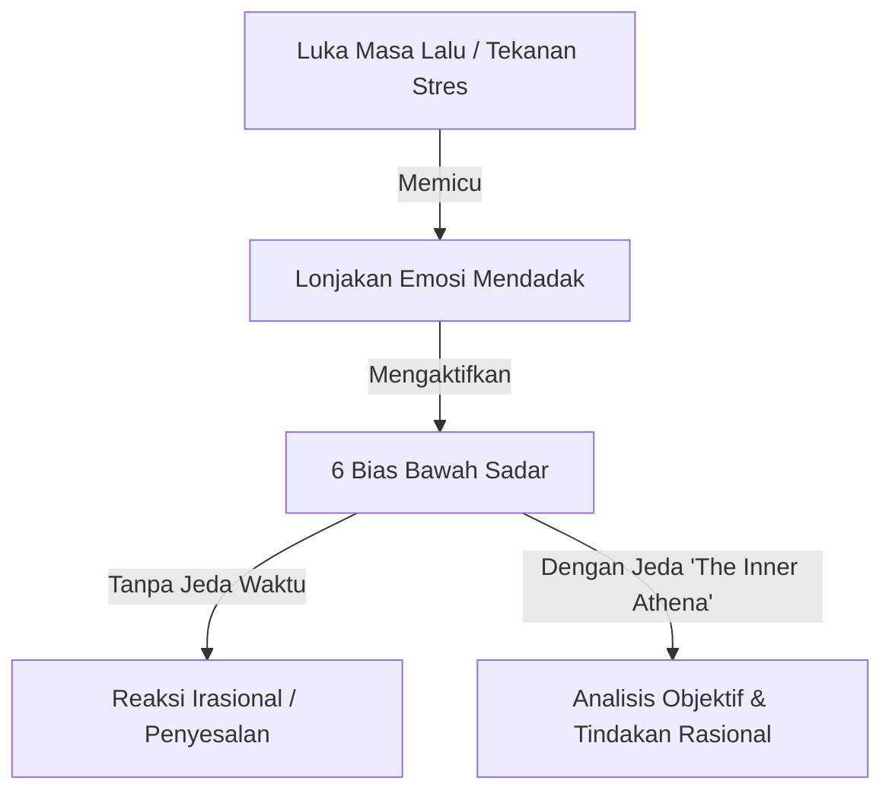

# 🌿 Anatomi Irasionalitas dan Emosi Bawah Sadar

> **Status:** Sprout (Ide Berkembang & Sintesis Awal)  
> **Dibuat:** 2026-08-25  
> **Benih Asal:** [[The Inner Athena dan Waktu Jeda Reaksi]] + [[6 Bias Emosional Bawah Sadar]]  

---

## 💡 Konsep Inti
Rasionalitas bukanlah ketiadaan emosi, melainkan kemampuan sadar untuk **mengenali bias internal** dan **menahan faktor pemicu (*inflaming factors*)** agar tidak mendikte proses pengambilan keputusan.

---

## 🔍 Hubungan Antara Pemicu dan Bias
Ketika kita mengalami stres berat atau menghadapi individu toksik, otak limbik mengambil alih. Dalam kondisi ini:
1. *Trigger points* masa lalu membuat kita reaktif dan defensif (*Blame Bias*).
2. Tekanan kelompok atau histeria publik mendorong kita mencari rasa aman kelompok (*Group Bias*).
3. Ego menolak mengakui kesalahan dan membentengi diri dengan *Superiority Bias*.

---

## 🛠️ Hipotesis & Latihan Praktis
Untuk menjembatani ide ini menjadi pengetahuan matang (*Evergreen Note*):
1. **Latihan Mengenali Sinyal Tubuh**: Jantung berdegup kencang, nafas memendek, atau keinginan kuat untuk langsung membalas argumen adalah alarm biologis bahwa irasionalitas sedang mengambil kendali.
2. **Accept People as Facts**: Memperlakukan manusia lain seperti cuaca atau hukum gravitasi—jangan tersinggung dengan sifat buruk orang lain, amati saja sebagai pola perilaku.

---

## 🔗 Tautan Evolusi Catatan
- Benih Asal: [[The Inner Athena dan Waktu Jeda Reaksi]], [[6 Bias Emosional Bawah Sadar]]
- Catatan Matang (Plant): [[Master Your Emotional Self - The Law of Irrationality]]
- Esai Publikasi (Harvest): [[Seni Menguasai Diri dan Berpikir Rasional di Bawah Tekanan]]
- Sumber Buku: [[The Laws of Human Nature]]
