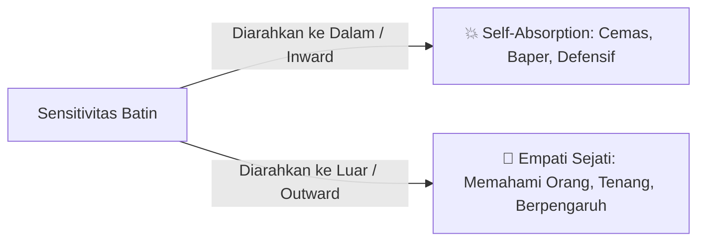

# 🌿 Mengubah Self-Absorption Menjadi Kekuatan Empati

> **Status:** Sprout (Ide Berkembang & Sintesis)  
> **Dibuat:** 2026-08-28  
> **Benih Asal:** [[Spektrum Narsisisme dan Ilusi Bebas Ego]] + [[4 Tingkatan Melatih Empati Sejati]]  

---

## 💡 Inti Elaborasi
Sebagian besar kecemasan sosial dan rasa tidak aman (*insecurity*) kita bersumber dari **arah kepekaan yang salah**. Kita menghabiskan energi untuk menatap ke dalam diri sendiri (*self-absorption*): *"Bagaimana penampilan saya?", "Apakah mereka menyukai saya?", "Bagaimana kalau saya berbuat salah?"*.

Ketika sensitivitas ini diputar 180 derajat ke luar (**Outward Focus**), rasa cemas itu lenyap dan bertransformasi menjadi **Kekuatan Empati**.

---

## 🧭 Dinamika Perubahan Energi Mental

1. **Dari Membela Ego Menjadi Memahami Realitas**:
   - Narsisis berat sibuk melindungi ego yang rapuh.
   - Narsisis sehat memiliki *self-worth* stabil dari dalam, sehingga tidak butuh validasi konstan dan memiliki kapasitas mental untuk benar-benar mendengarkan orang lain.

2. **Empati Sebagai Instrumen Pengaruh**:
   - Orang lain secara naluriah menyukai dan memercayai orang yang memberi mereka perhatian berkualitas (*deep undivided attention*).
   - Dengan memahami motif tersembunyi orang lain, kita dapat mengantisipasi tindakan mereka dan menurunkan resistensi pertahanan mereka dengan damai.

---

## 🔗 Tautan Evolusi Catatan
- Benih Asal: [[Spektrum Narsisisme dan Ilusi Bebas Ego]], [[4 Tingkatan Melatih Empati Sejati]]
- Catatan Matang (Plant): [[Transform Self-Love into Empathy - The Law of Narcissism]]
- Esai Publikasi (Harvest): [[Empati Sebagai Kekuatan Super - Seni Membaca Manusia Tanpa Terseret Drama]]
- Sumber Buku: [[The Laws of Human Nature]]
