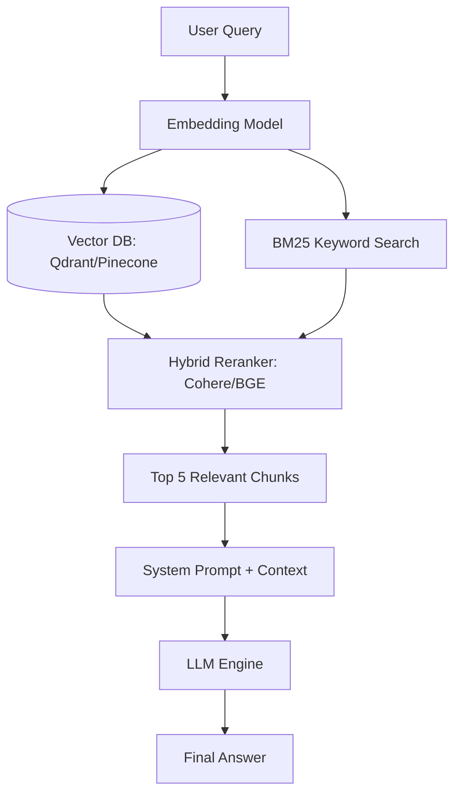

# 🌳 Panduan Komprehensif Rekayasa AI, RAG, dan Agentic Workflows

> **Status:** Plant / Evergreen Note (Matang & Dipublikasikan)  
> **Kategori:** AI & LLM Engineering  

> [!important] Prinsip Utama Arsitektur RAG & Agentic
> LLM berfungsi sebagai **mesin penalaran (Reasoning Engine)**, bukan basis data statis. Memisahkan konteks data eksternal melalui **Retrieval-Augmented Generation (RAG)** dan kemampuan mengeksekusi aksi melalui **Agentic Workflows (ReAct)** adalah kunci arsitektur AI tingkat industri.

---

## 📌 1. Arsitektur RAG Modern (Advanced RAG Pipeline)

Sistem RAG standar sering gagal karena masalah *Lost in the Middle* (LLM mengabaikan informasi di tengah konteks panjang).



### Komponen Kunci Advanced RAG:
1. **Hybrid Search**: Menggabungkan pencarian vektor (*Dense Retrieval*) untuk makna semantik dan *Sparse Search* (BM25) untuk kata kunci/SKU/nama persis.
2. **Context Compression**: Mengompresi chunk dokumen agar hanya menyisakan kalimat yang relevan dengan pertanyaan user.
3. **Reranking**: Mengurutkan ulang dokumen hasil retrieval menggunakan *Cross-Encoder Model*.

---

## 🤖 2. ReAct Pattern (Reasoning + Acting) pada Agentic AI

Dalam sistem agen mandiri, LLM beroperasi dalam loop rekursif:

```text
Thought: Saya perlu memeriksa saldo akun user di database.
Action: execute_sql_query("SELECT balance FROM users WHERE id = 42")
Observation: balance = 1500000
Thought: Saldo cukup. Sekarang saya akan memproses transaksi.
Action: call_payment_gateway(amount=500000)
Observation: status = "SUCCESS"
Final Answer: Transaksi sebesar Rp 500.000 berhasil diproses.
```

---

## 💻 Contoh Kode Python Implementasi Tool Calling Agent

```python
import json
from typing import Callable, Dict, Any

class AgentEngine:
    def __init__(self, llm_client, tools: Dict[str, Callable]):
        self.client = llm_client
        self.tools = tools

    def run(self, user_prompt: str, max_iterations: int = 5) -> str:
        messages = [{"role": "user", "content": user_prompt}]
        
        for i in range(max_iterations):
            response = self.client.chat(messages=messages, tools=self.get_tool_schemas())
            message = response.choices[0].message
            
            if not message.tool_calls:
                return message.content  # Agent selesai bernalar
                
            for tool_call in message.tool_calls:
                fn_name = tool_call.function.name
                args = json.loads(tool_call.function.arguments)
                print(f"[Agent Tool Call] Executing {fn_name} with args {args}")
                
                result = self.tools[fn_name](**args)
                messages.append({
                    "role": "tool",
                    "tool_call_id": tool_call.id,
                    "content": json.dumps(result)
                })
        return "Max iterations reached without resolution."
```

---

## 🔗 Tautan Terkait di Knowledge Garden
- Ide Awal: [[RAG dan Agentic Workflows]]
- Teknik Chunking: [[Desain Pipeline Vector Database dan Chunking]]
- Penerapan Debugging: [[Prinsip Systematic Debugging untuk AI Coding Agent]]
