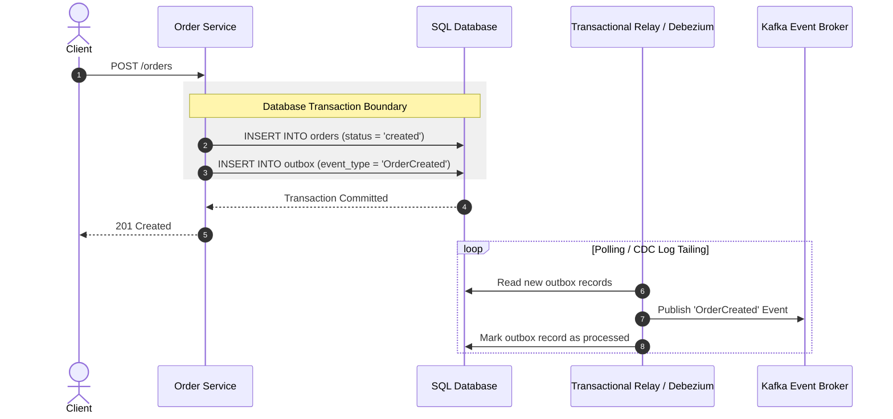

# 🏛️ Desain Sistem Terdistribusi Skala Besar dan Event-Driven Architecture

> **Status:** Plant / Evergreen Note (Matang & Dipublikasikan)  
> **Kategori:** System Design & Architecture  

> [!important] Prinsip Utama Arsitektur Terdistribusi
> Dalam sistem terdistribusi skala tinggi, kegagalan (*network partition/downtime*) bukanlah pengecualian, melainkan kepastian. Merancang sistem yang tahan banting (*resilient*) membutuhkan **Asynchronous Decoupling** dan **Transactional Outbox Pattern**.

---

## 📌 1. Transactional Outbox Pattern

Salah satu kegagalan paling sering terjadi di arsitektur microservices adalah situasi di mana data berhasil disimpan ke Database SQL, tetapi gagal dipublikasikan ke Message Broker (Kafka/RabbitMQ) karena jaringan terputus.

### Diagram Alur Transactional Outbox:



---

## 💻 2. Contoh Kode Implementation Outbox Pattern di Node.js/TypeScript

```typescript
import { EntityManager } from "typeorm"

export interface OrderData {
  userId: string
  amount: number
}

export class OrderService {
  async createOrder(entityManager: EntityManager, data: OrderData): Promise<string> {
    return await entityManager.transaction(async (transactionalEntityManager) => {
      // 1. Simpan entitas bisnis utama
      const order = transactionalEntityManager.create("Order", {
        userId: data.userId,
        amount: data.amount,
        status: "PENDING",
      })
      const savedOrder = await transactionalEntityManager.save(order)

      // 2. Simpan event ke tabel outbox dalam SATU transaksi SQL yang sama
      const outboxEvent = transactionalEntityManager.create("Outbox", {
        aggregateId: savedOrder.id,
        aggregateType: "Order",
        eventType: "OrderCreated",
        payload: JSON.stringify({ orderId: savedOrder.id, amount: savedOrder.amount }),
        processed: false,
      })
      await transactionalEntityManager.save(outboxEvent)

      return savedOrder.id
    })
  }
}
```

---

## ⚖️ 3. CAP Theorem dalam Praktik Real

```text
       Consistency (Ketersediaan Data Identik)
          / \
         /   \
        /     \
       /   CP  \
      /   (SQL) \
     /           \
    /  AP (NoSQL) \
   /_______________\
Availability       Partition Tolerance
(Respon Selalu ADA)  (Tahan Jaringan Putus)
```

1. **CP Systems (Consistency + Partition Tolerance)**: Memilih konsistensi data mutlak (contoh: PostgreSQL dengan *synchronous replication*, Google Spanner). Jika terjadi *partition*, sistem akan menolak tulisan daripada menyajikan data basi.
2. **AP Systems (Availability + Partition Tolerance)**: Memilih ketersediaan respon tinggi (contoh: Cassandra, DynamoDB). Sistem mengizinkan *eventual consistency*.

---

## 🔗 Tautan Terkait di Knowledge Garden
- Ide Awal: [[Event Driven vs Request Driven]]
- Pemilihan Broker: [[Message Broker Kafka vs RabbitMQ]]
- Penerapan Caching: [[Databases]]
