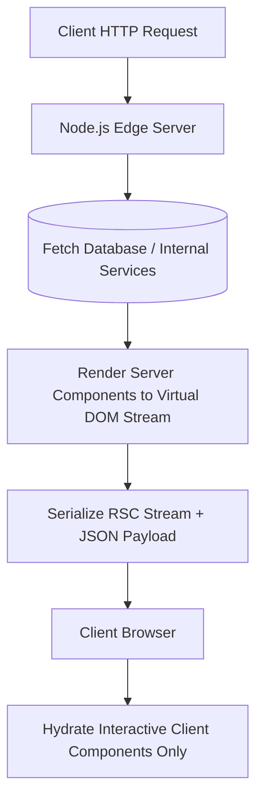

# 🌐 Rekayasa Frontend Modern, Core Web Vitals, dan React Server Components

> **Status:** Plant / Evergreen Note (Matang & Dipublikasikan)  
> **Kategori:** Modern Frontend Engineering  

> [!tip] Filosofi Utama Performa Frontend
> Performa frontend bukan sekadar membuat halaman memuat cepat, tetapi meminimalkan **Work on the Main Thread** (beban thread utama JS) agar interaksi pengguna instan tanpa jeda (*zero lag*).

---

## 📌 1. Strategi Arsitektur React Server Components (RSC)

RSC mengubah paradigma tradisional React dari *Client-Side Rendering (CSR)* atau *Single Page App (SPA)* bundle jumbo menjadi arsitektur komposisi hybrid.



---

## 💻 2. Contoh Komposisi RSC dan Client Component

```tsx
// 1. Server Component (ProductList.tsx - Ran di Server, 0 KB Client JS)
import { db } from "@/lib/db"
import LikeButton from "./LikeButton" // Client Component

export default async function ProductList() {
  // Query database langsung tanpa API endpoint perantara
  const products = await db.products.findMany({ take: 10 })

  return (
    <div className="grid grid-cols-3 gap-4">
      {products.map((product) => (
        <div key={product.id} className="p-4 border rounded">
          <h2>{product.name}</h2>
          <p>Rp {product.price.toLocaleString("id-ID")}</p>
          {/* HANYA tombolLike ini yang dikirim JS JS-nya ke browser */}
          <LikeButton productId={product.id} initialLikes={product.likes} />
        </div>
      ))}
    </div>
  )
}
```

```tsx
// 2. Client Component (LikeButton.tsx)
"use client"

import { useState } from "react"

export default function LikeButton({ productId, initialLikes }: { productId: string; initialLikes: number }) {
  const [likes, setLikes] = useState(initialLikes)

  return (
    <button 
      onClick={() => setLikes(l => l + 1)}
      className="px-3 py-1 bg-blue-600 text-white rounded hover:bg-blue-700"
    >
      ❤️ {likes} Likes
    </button>
  )
}
```

---

## ⚡ 3. Tiga Pilar Core Web Vitals (2026 Standard)

1. **Largest Contentful Paint (LCP)**:
   - *Target*: $< 2.5$ detik.
   - *Solusi*: Preload gambar pahlawan (*hero image*) menggunakan `<link rel="preload">`, gunakan format AVIF/WebP, & jalankan CDN Caching di Edge.
2. **Interaction to Next Paint (INP)**:
   - *Target*: $< 200$ milidetik.
   - *Solusi*: Pecah tugas berat JavaScript dengan `startTransition` atau `requestIdleCallback`.
3. **Cumulative Layout Shift (CLS)**:
   - *Target*: $< 0.1$.
   - *Solusi*: Selalu cantumkan `width` dan `height` eksplisit pada elemen `` dan `<iframe>` untuk reservasi ruang memori layout.

---

## 🔗 Tautan Terkait di Knowledge Garden
- Ide Awal: [[Web Performance Metrics]]
- Perbandingan RSC: [[Server Components vs Client Components]]
- Performa Caching: [[Performance]]
