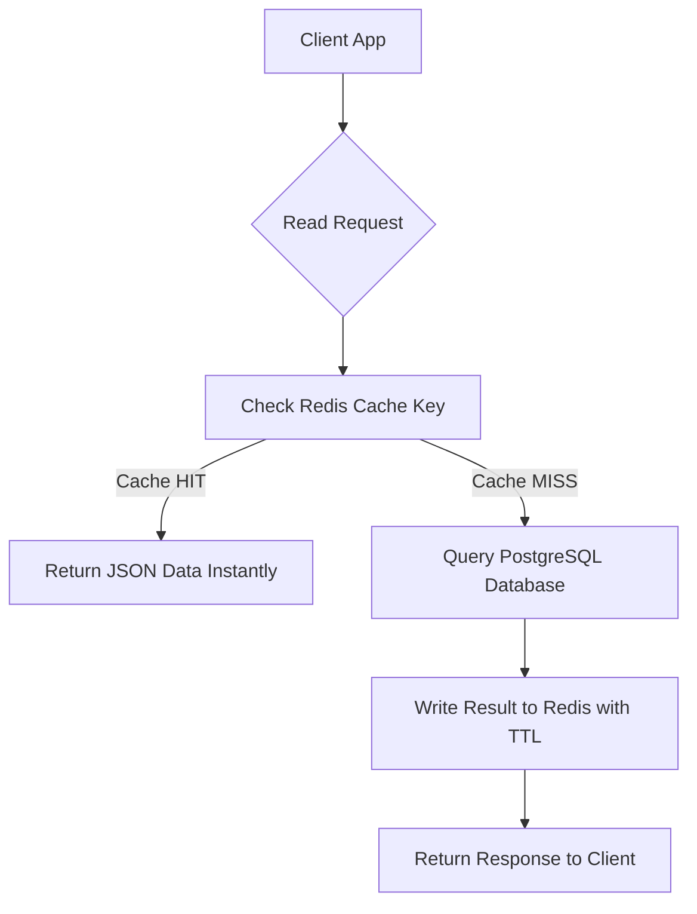

# 🗄️ Panduan Rekayasa Basis Data, Optimasi Query PostgreSQL, dan Caching Redis

> **Status:** Plant / Evergreen Note (Matang & Dipublikasikan)  
> **Kategori:** Database Engineering & Data Modeling  

> [!important] Prinsip Utama Desain Basis Data
> Pemilihan index yang tepat pada PostgreSQL dapat memangkas waktu eksekusi query dari 5000ms (*Sequential Scan*) menjadi < 2ms (*Index Scan*). Dipadukan dengan Redis Caching, aplikasi Anda dapat melayani ribuan request per detik tanpa *database bottleneck*.

---

## 📌 1. Membaca Rencana Eksekusi Query (`EXPLAIN ANALYZE`)

Sebelum mengklaim sebuah query SQL lambat, selalu jalankan `EXPLAIN (ANALYZE, BUFFERS)` di PostgreSQL:

```sql
EXPLAIN (ANALYZE, BUFFERS)
SELECT u.id, u.email, o.total_amount
FROM users u
JOIN orders o ON u.id = o.user_id
WHERE o.created_at >= '2026-01-01' AND o.status = 'COMPLETED';
```

### Yang Harus Diwaspadai pada Execution Plan:
1. ❌ **Seq Scan (Sequential Scan)**: Postgres membaca seluruh tabel baris demi baris dari disk. Solusi: Buat index pada kolom yang diproses di `WHERE` atau `JOIN`.
2. ❌ **Filter Removed Rows**: Angka baris yang dibuang tinggi. Berarti index kurang spesifik.
3. ✅ **Index Scan / Index Only Scan**: Query langsung meloncat ke blok disk spesifik via B-Tree index.

---

## 📊 2. Pola Arsitektur Caching (Cache-Aside Pattern)



---

## 💻 3. Contoh Implementasi Cache-Aside Pattern di PHP / TypeScript

```php
namespace App\Services;

use Illuminate\Support\Facades\Cache;
use App\Models\User;

class UserProfileService 
{
    public function getUserProfile(int $userId): array 
    {
        $cacheKey = "user_profile:{$userId}";

        // 1. Coba baca dari Redis (TTL: 1 Jam / 3600 Detik)
        return Cache::remember($cacheKey, 3600, function () use ($userId) {
            // 2. Jika Cache MISS, query PostgreSQL
            $user = User::with(['profile', 'settings'])->findOrFail($userId);
            
            return [
                'id' => $user->id,
                'email' => $user->email,
                'name' => $user->name,
                'avatar' => $user->profile->avatar_url,
                'theme' => $user->settings->theme_mode,
            ];
        });
    }
}
```

---

## ⚡ 4. PostgreSQL Indexing Strategies

```sql
-- 1. Composite Index (B-Tree Multi-Kolom)
-- Aturan: Urutkan kolom dengan kardinalitas tertinggi / penyaringan paling ketat terlebih dahulu
CREATE INDEX idx_orders_user_status ON orders (user_id, status);

-- 2. Partial Index (Hanya mengindeks baris yang aktif untuk menghemat ukuran file index)
CREATE INDEX idx_active_users ON users (email) WHERE is_active = TRUE;

-- 3. GIN Index untuk Kolom JSONB (Pencarian atribut fleksibel)
CREATE INDEX idx_products_metadata ON products USING GIN (metadata);
-- Query yang memanfaatkan GIN Index:
-- SELECT * FROM products WHERE metadata @> '{"color": "red"}';
```

---

## 🔗 Tautan Terkait di Knowledge Garden
- Ide Awal: [[Optimasi Query SQL]]
- Tipe Index: [[Indexing B-Tree dan GIN di PostgreSQL]]
- Arsitektur Terdistribusi: [[System Design]]
