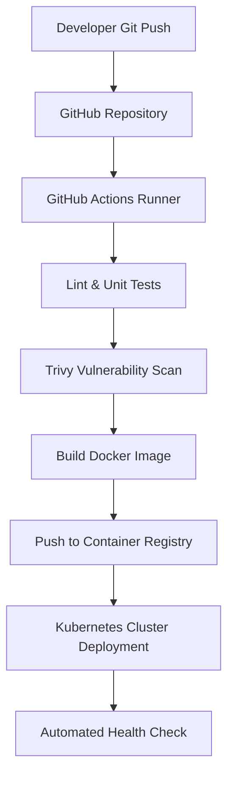

# ☁️ Panduan Rekayasa DevOps, Containerization Docker, dan Kubernetes

> **Status:** Plant / Evergreen Note (Matang & Dipublikasikan)  
> **Kategori:** DevOps & Cloud Infrastructure  

> [!important] Prinsip Utama DevOps Modern
> Infrastruktur harus diperlakukan sebagai kode (*Infrastructure as Code*). **Immutable Infrastructure** memastikan lingkungan pengujian (*staging*) dan produksi (*production*) 100% identik melalui kontainerisasi.

---

## 📌 1. Multi-Stage Docker Build Optimization

Multi-stage build memangkas ukuran image Docker produksi dari 1GB+ menjadi < 50MB dengan memisahkan *build environment* dan *runtime environment*.

```dockerfile
# Stage 1: Build Phase
FROM node:22-alpine AS builder
WORKDIR /app
COPY package*.json ./
RUN npm ci
COPY . .
RUN npm run build

# Stage 2: Production Runtime Phase
FROM node:22-alpine AS runner
WORKDIR /app
ENV NODE_ENV=production
COPY package*.json ./
RUN npm ci --only=production
COPY --from=builder /app/dist ./dist

USER node
EXPOSE 3000
CMD ["node", "dist/index.js"]
```

---

## 📊 2. Diagram Deployment Pipeline CI/CD



---

## 🔗 Tautan Terkait di Knowledge Garden
- Arsitektur Sistem: [[System Design]]
- Keamanan Kontainer: [[Cybersecurity]]
- Performa Deployment: [[Performance]]
