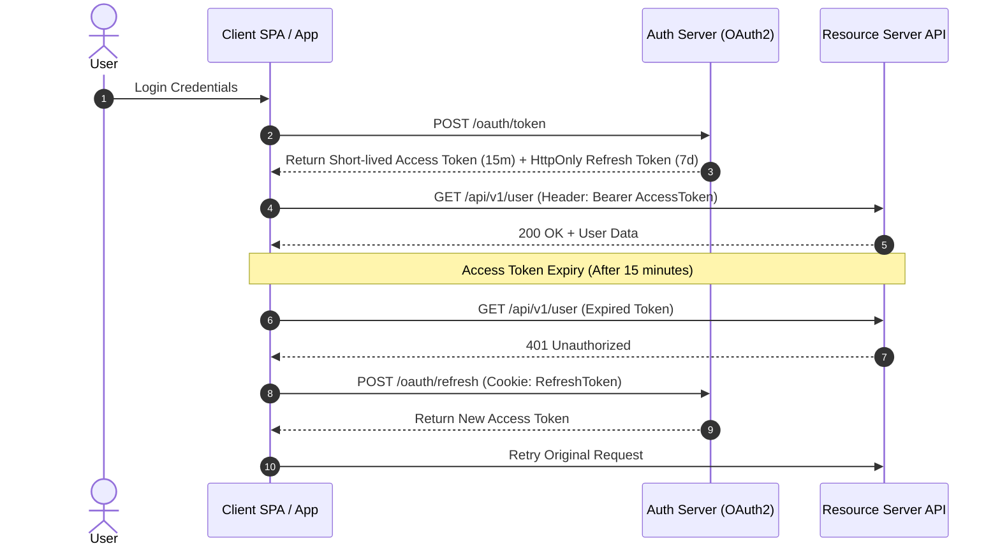

# 🔒 Hardening Keamanan Aplikasi Web dan Arsitektur OAuth2 / JWT

> **Status:** Plant / Evergreen Note (Matang & Dipublikasikan)  
> **Kategori:** Cybersecurity & Application Security  

> [!important] Defense in Depth
> Keamanan tidak boleh hanya mengandalkan satu lapisan (misal: hanya firewall). Penerapan **Defense in Depth** memastikan setiap lapisan—mulai dari header HTTP, autentikasi, validasi input, hingga enkripsi database—memiliki benteng pertahanan independen.

---

## 📌 1. Alur Autentikasi OAuth2 + JWT (Access & Refresh Tokens)



---

## 💻 2. Mitigasi OWASP Top 10 pada Node.js / PHP

```javascript
// Mitigasi Security Headers dengan Helmet di Express.js
import express from "express"
import helmet from "helmet"
import rateLimit from "express-rate-limit"

const app = express()

// 1. Set Security Headers (CSP, HSTS, X-Frame-Options)
app.use(helmet())

// 2. Mitigasi Brute Force & Denial of Service dengan Rate Limiting
const apiLimiter = rateLimit({
  windowMs: 15 * 60 * 1000, // 15 Menit
  max: 100, // Maksimal 100 request per IP
  message: { error: "Terlalu banyak permintaan dari IP ini, coba lagi nanti." },
  standardHeaders: true,
  legacyHeaders: false,
})

app.use("/api/", apiLimiter)
```

---

## 🔗 Tautan Terkait di Knowledge Garden
- Desain Sistem: [[System Design]]
- Keamanan Database: [[Databases]]
- Standar Kualitas Kode: [[Clean Code]]
