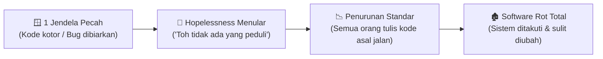

# 🌳 Software Entropy dan Strategi Mengatasi Technical Debt

> **Status:** Plant / Evergreen Note (Matang & Terverifikasi)  
> **Kategori:** [[Clean Code]] & Software Architecture  
> **Referensi Utama:** [[The Pragmatic Programmer]] (David Thomas & Andrew Hunt)  

---

> [!important] Hukum Entropi Perangkat Lunak
> Perangkat lunak tidak tunduk pada hukum fisika material, namun **Hukum Kedua Termodinamika** berlaku mutlak: *tanpa intervensi aktif, tingkat ketidakteraturan (entropi) dalam sistem software akan selalu meningkat menuju batas maksimum.*

---

## 🏚️ Teori Jendela Pecah (*Broken Windows Theory*)

Penelitian kriminologi menunjukkan bahwa sebuah gedung dengan **satu jendela pecah yang dibiarkan tidak diperbaiki** akan memicu orang lain untuk memecahkan jendela-jendela lainnya, membuat coretan dinding (*graffiti*), hingga akhirnya merusak seluruh struktur bangunan.



Di dalam tim rekayasa software, **sikap putus asa (*hopelessness*) menular lebih cepat daripada virus flu**. Ketika developer melihat kode yang rusak dibiarkan, motivasi untuk menulis kode bersih akan runtuh.

---

## 🛠️ 3 Strategi Taktis Melawan Entropi

### 1. Perbaiki "Jendela Pecah" Segera (*Fix Bad Windows Promptly*)
Jika Anda menemukan fungsi yang buruk atau bug kecil saat mengerjakan tugas:
- **Jika ada waktu**: Perbaiki langsung (*refactor*).
- **Jika waktu terbatas**: Beri tanda `// TODO: [Refactor]` atau buat ticket task spesifik, dan jangan biarkan kode rusak tersebut menjadi contoh bagi developer lain.

### 2. Boy Scout Rule (Aturan Pramuka)
> *"Selalu tinggalkan perkemahan dalam kondisi lebih bersih daripada saat Anda datang."*

Pada setiap Pull Request (PR):
- Jangan hanya menambah fitur baru.
- Luangkan waktu 5-10 menit untuk merapikan nama variabel yang ambigu, menghapus baris kode mati (*dead code*), atau merapikan format file yang Anda sentuh.

### 3. Pisahkan Antara "Pragmatic Debt" vs "Reckless Rot"

| Aspek | Technical Debt Terencana | Software Rot (Entropi Liar) |
| :--- | :--- | :--- |
| **Penyebab** | Kompromi sadar demi validasi pasar / deadline kritis | Kemalasan, kurangnya standar, & tidak ada review |
| **Dokumentasi** | Tercatat di backlog & ada rencana pelunasan | Tersembunyi di sela-sela kode tanpa penjelasan |
| **Mitigasi** | Dilunasi pada sprint berikutnya | Menumpuk hingga sistem harus di-rewrite total |

---

## 💻 Contoh Nyata: Sebelum & Sesudah Refactoring

### ❌ Sebelum: Jendela Pecah (Hardcoded Magic & Multi-Responsibility)
```php
// Melanggar SRP dan menyembunyikan 'magic number' yang rawan membusuk
class OrderHandler {
    public function process($order) {
        if ($order->status == 1) { // Apa arti status 1?
            $total = $order->qty * $order->price;
            if ($total > 1000000) {
                $total -= $total * 0.1; // Hardcoded diskon
            }
            DB::table('orders')->where('id', $order->id)->update(['total' => $total, 'status' => 2]);
            Mail::to($order->email)->send(new InvoiceMail($order));
        }
    }
}
```

### ✅ Sesudah: Kode Bersih, Ekspresif, & Teruji
```php
enum OrderStatus: int {
    case PENDING = 1;
    case PROCESSED = 2;
}

class OrderHandler {
    public function __construct(
        private readonly DiscountCalculator $discountCalculator,
        private readonly OrderRepository $orderRepository,
        private readonly NotificationService $notifier
    ) {}

    public function process(Order $order): void {
        if ($order->status !== OrderStatus::PENDING) {
            return;
        }

        $finalPrice = $this->discountCalculator->calculateFor($order);
        $this->orderRepository->markAsProcessed($order, $finalPrice);
        $this->notifier->sendInvoice($order);
    }
}
```

---

## 🔗 Tautan Terkait di Knowledge Garden
- Asal Pembibitan: [[Software Entropy dan Broken Windows Theory]] & [[Software Entropy dan Technical Debt]]
- Penerapan Arsitektur: [[Penerapan 5 Prinsip SOLID dan Refactoring Code Smells]]
- Sumber Asli: [[The Pragmatic Programmer]]
