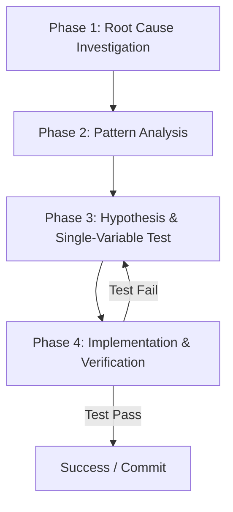

# 🌳 Prinsip Systematic Debugging untuk AI Coding Agent

> **Status:** Plant / Evergreen Note (Matang & Dipublikasikan)  
> **Kategori:** Artificial Intelligence / Software Engineering  

> [!important] The Iron Law of Debugging
> **Dilarang melakukan perbaikan kode sebelum investigasi akar masalah (root cause) terbukti secara nyata.** Menutupi error dengan try-catch tanpa memahami penyebabnya adalah kegagalan debugging.

---

## 📌 Pendahuluan

Saat mengintegrasikan AI Agentic Coding ke dalam *software development pipeline*, salah satu tantangan terbesar adalah mencegah AI melakukan perbaikan asal-asalan (*blind guess & check*). 

Metodologi **Systematic Debugging** memastikan AI beroperasi dengan standar keinsinyuran perangkat lunak yang ketat.

---

## 📊 Diagram Alur Debugging 4 Fase

---

## 🛠️ Empat Fase Systematic Debugging

### 1. Root Cause Investigation
Sebelum menyentuh satu baris kode pun:
- Baca seluruh pesan error dan *stack trace* sampai selesai.
- Periksa riwayat perubahan git (`git diff`).
- Isolasi komponen tempat data pertama kali mengalami anomali.

### 2. Pattern Analysis
- Cari contoh kode sejenis di codebase yang berjalan dengan sukses.
- Bandingkan perbedaan spesifik antara kode yang berfungsi dan kode yang rusak.

### 3. Hypothesis & Minimal Test
- Buat satu hipotesis eksplisit: *"Saya menduga fungsi X gagal karena argumen Y bernilai undefined"*.
- Lakukan pengujian perubahan paling minimal (1 variabel).

### 4. Implementation & Verifikasi Empiris
- Tulis unit test yang mereproduksi kegagalan terlebih dahulu (TDD).
- Jalankan perintah *build/test* dan pastikan outputnya menunjukkan status *PASS*.

---

## 🔗 Catatan Terkait di Garden Ini
- Ide Awal: [[AI Agentic Reasoning]]
- Catatan Diskusi: [[Systematic Debugging di AI Agent]]
- Artikel Hasil Panen: [[Panduan Lengkap Merancang AI Coding Agent yang Andal]]
