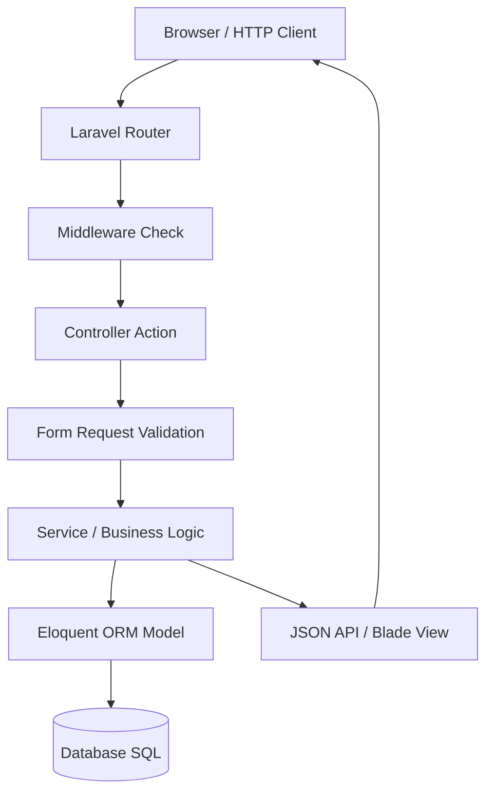

# 🌳 Roadmap Kuasai PHP Modern dan Laravel Framework

> **Status:** Plant / Evergreen Note (Matang & Dipublikasikan)  
> **Kategori:** Programming / Web Development  

> [!tip] Konsep Utama
> Jangan pernah langsung melompat ke Laravel tanpa menguasai fondasi **PHP Native OOP** dan **Clean Code**. Pemahaman tentang *Composer*, *Namespaces*, dan *Dependency Injection* adalah kunci memahami keajaiban ajaib (*magic*) Laravel.

---

## 🗺️ Peta Jalan Belajar Bertahap (3 Fase Utama)

### Fase 1: PHP Dasar & Modern Fundamentals
1. **Sintaks Dasar & Control Flow**: Variabel, Tipe Data, Arrays, Loops, Conditions.
2. **Object-Oriented Programming (OOP)**: Classes, Objects, Inheritance, Encapsulation, Polymorphism, Interfaces, & Traits.
3. **Strict Typing & PHP 8.x Features**: Constructor Property Promotion, Match Expressions, Named Arguments, & Nullsafe Operator.
4. **Composer & Autoloading**: Manajemen dependensi packages (`packagist.org`) dan PSR-4 Autoloading.

---

### Fase 2: Clean Code & Design Patterns di PHP
1. **Prinsip SOLID**: SRP, OCP, LSP, ISP, & DIP.
2. **PSR Standards**: PSR-1, PSR-4, & PSR-12.
3. **Refactoring & Code Smells**: Menghindari fungsi yang terlalu panjang, *deep nesting*, dan variabel tanpa arti.
4. **Design Patterns Populer**: Repository Pattern, Factory Pattern, DTO (Data Transfer Objects), & Singleton Pattern.

---

### Fase 3: Laravel Framework Mastery
1. **Arsitektur MVC (Model-View-Controller)**.
2. **Routing & Middleware**: Keamanan request, autentikasi, & throttling.
3. **Service Container & Dependency Injection**: Paham cara kerja `app()`, Binds, dan Singletons.
4. **Eloquent ORM**: Relationships (One-to-Many, Many-to-Many), Mutators/Accessors, & Query Scopes.
5. **Form Requests & Validation**: Memisahkan aturan validasi dari Controller.

---

## 📊 Diagram Alur Request di Laravel

---

## 🔗 Catatan Terkait di Garden Ini
- Ide Awal: [[Evolusi PHP dan Ekosistem Framework]]
- Rangkuman SOLID: [[Prinsip SOLID dan Clean Code pada PHP]]
- Artikel Publikasi Hasil Panen: [[Panduan Komprehensif Membangun Aplikasi Web Modern dengan PHP 8 dan Laravel]]
