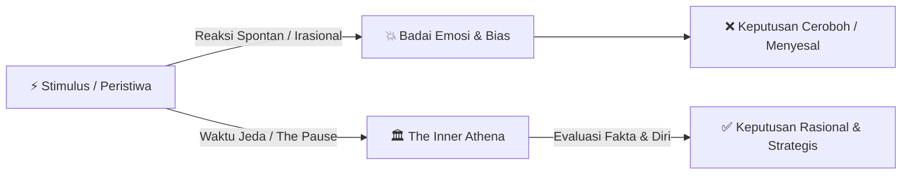

# 🧠 Master Your Emotional Self: The Law of Irrationality

> *"Manusia suka membayangkan diri mereka rasional, memegang kendali atas hidup mereka, dan mengambil keputusan berdasarkan fakta objektif. Namun kenyataannya, kita terus-menerus dikendalikan oleh emosi dan motif bawah sadar yang jarang kita sadari."*  
> — **Robert Greene**, *The Laws of Human Nature* (Hukum ke-1)

---

## 🏛️ Intisari & Konsep Utama (*The Inner Athena*)

Dalam sejarah Yunani Kuno, negarawan besar Athena, **Pericles**, dikenal bukan karena kepintaran bicaranya yang berapi-api, melainkan karena kemampuannya untuk **menahan diri dan tidak langsung bereaksi saat dilanda emosi**.

Ketika warga Athena panik dan terdorong oleh kemarahan atau euforia perang, Pericles selalu mundur selangkah untuk berpikir tenang. Sikap ini dilambangkan dengan penghormatannya kepada dewi kebijaksanaan, **Athena**—representasi dari pikiran yang tenang, objektif, dan terbebas dari badai emosi sesaat.

> [!evergreen] Definisi Rasionalitas Menurut Robert Greene
> **Rasionalitas bukanlah bawaan lahir**, melainkan keterampilan yang harus dilatih terus-menerus. Rasionalitas adalah kemampuan untuk menetralisir efek emosi terhadap proses berpikir kita, melihat realitas apa adanya, bukan sebagaimana yang kita inginkan atau takuti.

---

## 🔍 Langkah 1: Kenali 6 Bias Bawah Sadar (*Recognize the Biases*)

Langkah awal menuju rasionalitas adalah menyadari bahwa **kita semua bias**. Otak manusia secara alami mencari jalan pintas untuk mempertahankan ego dan kenyamanan psikologis:

### 1. Confirmation Bias (Bias Konfirmasi)
- **Pola:** Kita hanya mencari data, artikel, atau opini yang mendukung keyakinan kita yang sudah ada, serta mengabaikan atau menolak bukti yang berlawanan.
- **Bahaya:** Menciptakan ilusi kepastian dan menutup diri dari kebenaran.

### 2. Conviction Bias (Bias Keyakinan yang Berlebihan)
- **Pola:** Meyakini bahwa semakin kuat perasaan atau keyakinan kita terhadap suatu ide, maka ide tersebut pasti benar.
- **Bahaya:** Emosi yang menggebu-gebu sering kali digunakan untuk menutupi keraguan dan kurangnya bukti nyata.

### 3. Appearance Bias (Bias Penampilan)
- **Pola:** Menilai karakter, kapabilitas, atau kejujuran seseorang semata-mata dari penampilan fisik, gaya bicara yang karismatik, atau pembawaan luar.
- **Bahaya:** Mudah tertipu oleh orang-orang yang manipulatif atau narsistik.

### 4. Group Bias (Bias Kelompok / Tribalisme)
- **Pola:** Mengadopsi ide, opini, dan kemarahan suatu kelompok tanpa memverifikasinya secara mandiri karena takut dikucilkan.
- **Bahaya:** Menghilangkan pemikiran kritis independen (*groupthink*).

### 5. Blame Bias (Bias Menyalahkan Faktor Luar)
- **Pola:** Ketika rencana gagal atau timbul masalah, reaksi pertama kita adalah mencari kambing hitam di luar diri kita (rekan kerja, situasi ekonomi, nasib buruk).
- **Bahaya:** Kita tidak pernah belajar dari kesalahan sendiri dan terus mengulanginya.

### 6. Superiority Bias (Bias Merasa Lebih Rasional)
- **Pola:** Menganggap orang lain irasional dan penuh bias, sementara kita sendiri merasa objektif, adil, dan berpikiran terbuka.
- **Bahaya:** Bentuk bias paling berbahaya karena membutakan kita dari kelemahan diri sendiri.

---

## ⚠️ Langkah 2: Waspadai Faktor Pemicu Lonjakan Emosi (*Beware the Inflaming Factors*)

Emosi tidak selalu berada pada intensitas yang sama. Terdapat pemicu (*triggers*) yang bisa meningkatkan kadar irasionalitas hingga melumpuhkan akal sehat:

| Faktor Pemicu | Mekanisme & Dampak |
| :--- | :--- |
| **Trigger Points Masa Lalu** | Kata-kata atau gestur tertentu memicu kembali luka/trauma emosional masa kecil, membuat reaksi kita tidak proporsional dengan situasi saat ini. |
| **Sudden Gain or Loss** | Keberuntungan mendadak (keuntungan besar, promosi cepat) memicu euforia berlebihan (*hubris*); kerugian mendadak memicu kepanikan dan keputusan destruktif. |
| **Rising Pressure & Stress** | Tekanan tenggat waktu atau krisis mempersempit ruang pandang kognitif, memaksa kita mengambil keputusan instingtif yang dangkal. |
| **Inflaming Individuals** | Berhadapan dengan kepribadian toksik, provokator, atau narsistik yang sengaja memancing kemarahan dan ketakutan kita. |
| **The Group Effect** | Berada di tengah kerumunan massa yang emosional atau tren media sosial yang memperkuat histeria kelompok. |

---

## 🎯 Langkah 3: Strategi Menumbuhkan Diri Rasional (*Bringing Out the Rational Self*)

Untuk menguasai diri emosional dan mencapai kebijaksanaan seperti Pericles, Robert Greene menyarankan 5 disiplin mental:

### 1. Kenali Diri Anda Secara Mendalam (*Know Yourself Thoroughly*)
- Amati bagaimana Anda berperilaku saat berada di bawah tekanan stres atau kemarahan.
- Pahami kelemahan emosional terbesar Anda (mudah tersinggung, haus pujian, takut konfrontasi).

### 2. Telusuri Emosi Hingga ke Akarnya (*Examine Emotions to Their Roots*)
- Saat merasakan kemarahan atau kecemburuan mendalam, tanyakan pada diri sendiri: *"Dari mana asal perasaan ini sebenarnya? Apakah ini benar-benar karena orang tersebut, atau karena luka ego saya sendiri?"*

### 3. Tingkatkan Waktu Jeda Reaksi (*Increase Reaction Time / The Pause*)
- **Aturan Emas:** Jangan pernah merespons, mengirim pesan, atau mengambil keputusan besar saat sedang marah, takut, atau sangat gembira.
- Luangkan waktu jeda 24 jam. Biarkan hormon emosi mereda sebelum menganalisis situasi dengan kepala dingin.

### 4. Terima Manusia Sebagai Fakta Alamiah (*Accept People as Facts*)
- Jangan berharap orang lain bertindak sesuai standar ideal Anda.
- Lihat orang lain layaknya fenomena alam (batu, tanaman, cuaca)—amati perilakunya secara objektif tanpa baper atau tersinggung.

### 5. Cintai Proses Berpikir Rasional (*Love the Rational*)
- Rasionalitas bukan berarti menjadi robot tanpa emosi (*stoic stiffness*), melainkan menemukan keharmonisan antara **energi emosi** dan **pengarah akal sehat**. Rasionalitas memberikan ketenangan batin, kejelasan arah, dan hasil keputusan jangka panjang yang solid.

---

## 💡 Penerapan Nyata (Engineering, Karir, & Kehidupan)

> [!tip] Implementasi Sehari-hari
> - **Code Review & Kritik Teknis:** Hindari *Blame Bias* atau *Conviction Bias*. Saat kode Anda dikritik, jangan anggap itu sebagai serangan personal; perlakukan sebagai kesempatan verifikasi objektif demi kualitas sistem.
> - **Krisis Sistem & Downtime Produksi:** Terapkan *The Pause* dan *The Inner Athena*. Jangan panik atau saling menyalahkan; fokuslah pada mitigasi insiden, pengumpulan fakta log/metrik, dan *post-mortem* tanpa mencari kambing hitam (*blameless post-mortem*).
> - **Negosiasi & Hubungan Kerja:** Perlakukan rekan kerja yang sulit sebagai studi karakter psikologis (*people as facts*), bukan musuh pribadi.

---

## 🔄 Rantai Siklus Pertumbuhan (Growth Cycle)
- 🌱 **Seeds (Benih Awal):** [[The Inner Athena dan Waktu Jeda Reaksi]] & [[6 Bias Emosional Bawah Sadar]]
- 🌿 **Sprout (Tunas Elaborasi):** [[Anatomi Irasionalitas dan Emosi Bawah Sadar]]
- 🌳 **Plant (Catatan Matang Ini):** [[Master Your Emotional Self - The Law of Irrationality]]
- 🌾 **Harvest (Hasil Sintesis / Esai Publik):** [[Seni Menguasai Diri dan Berpikir Rasional di Bawah Tekanan]]

---

## 🔗 Referensi & Catatan Terkait
- 📖 Sumber Buku: [[The Laws of Human Nature]]
- 🧠 Hub Psikologi: [[Psychology]]
- 🧹 Kualitas & Sikap Profesional: [[Clean Code]]
- 🛠️ Efektivitas & Disiplin Kerja: [[Dev Productivity]]

