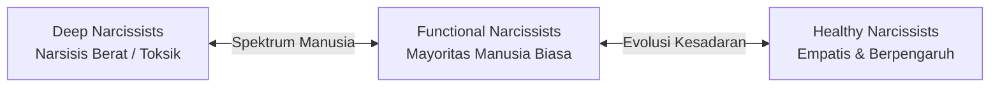

# 🧠 Transform Self-Love into Empathy: The Law of Narcissism

> *"Kita semua secara alami memiliki alat paling luar biasa untuk terhubung dengan manusia lain dan meraih pengaruh sosial sejati—yaitu empati. Namun, instrumen ini tumpul akibat kebiasaan kita yang terlalu sibuk memikirkan diri sendiri (self-absorption)."*  
> — **Robert Greene**, *The Laws of Human Nature* (Hukum ke-2)

---

## 🌊 Kebutuhan Alami Manusia Akan Perhatian
Sejak lahir, manusia memiliki kebutuhan tanpa akhir akan **perhatian dan pengakuan (*attention & validation*)**. Kita adalah makhluk sosial tulen. Tanpa tatapan dan pengakuan dari orang lain, manusia mulai meragukan keberadaan dirinya sendiri dan tergelincir ke dalam depresi.

Namun, cara kita memenuhi kebutuhan cinta-diri (*self-love*) inilah yang menentukan di mana posisi kita dalam **Spektrum Narsisisme**.

---

## 📊 Spektrum Narsisisme (The Narcissistic Spectrum)

Robert Greene menjelaskan bahwa kita semua adalah narsisis dalam derajat yang berbeda-beda:

### 1. Deep Narcissists (Narsisis Berat)
- **Ciri:** Tidak memiliki rasa diri yang utuh (*no cohesive self*). Ego mereka sangat rapuh, memandang orang lain semata-mata sebagai instrumen pemuas ego (*narcissistic supply*).
- **Perilaku:** Hipersensitif terhadap kritik, sering *playing victim*, mengontrol orang lain, dan tidak memiliki kapasitas empati sejati.

### 2. Functional Narcissists (Narsisis Rata-Rata)
- **Ciri:** Memiliki rasa percaya diri yang cukup untuk menjalani hidup, tetapi rentan tergelincir ke dalam **self-absorption** saat dilanda rasa tidak aman (*insecurity*).
- **Perilaku:** Sering sibuk memikirkan penilaian orang lain terhadap dirinya dibanding benar-benar mendengarkan lawan bicara.

### 3. Healthy Narcissists (Narsisis Sehat)
- **Ciri:** Memiliki fondasi *self-esteem* yang stabil dan utuh dari dalam diri.
- **Kekuatan:** Karena tidak lagi sibuk mempertahankan ego yang rapuh, mereka mampu mengarahkan kepekaannya **ke luar (*outward focus*)** untuk menciptakan karya hebat dan memahami dunia batin orang lain secara mendalam (**Empati Sejati**).

---

## 🎭 4 Arketipe Narsisis Toksik (Four Toxic Types)

Untuk mencegah diri kita terjebak dalam manipulasi emosional, kita harus mengenali 4 tipe narsisis berat di sekitar kita:

| Tipe Narsisis | Karakteristik Utama | Taktik Manipulasi |
| :--- | :--- | :--- |
| **The Control Freak** | Harus mengatur setiap keputusan dan gerak-gerik orang lain. | Ledakan kemarahan, *micromanagement*, merusak kemandirian orang lain. |
| **The Theatrical Narcissist** | Haus drama dan panggung perhatian konstan. | Menciptakan krisis palsu, intrik emosional, dan *playing victim*. |
| **The Grifter / Charmer** | Karismatik, memikat, dan penuh sanjungan di awal. | *Love bombing*, janji-janji manis, perlahan menguras sumber daya Anda. |
| **The Entangled Narcissist** | Menjerat pasangan dalam ketergantungan toksik. | Memanipulasi rasa bersalah dan membelenggu kebebasan pasangan. |

---

## 🏛️ 4 Pilar Menumbuhkan Empati Sejati (The Four Components of Empathy)

Empati bukanlah sifat pasif, melainkan sebuah **keterampilan (*skill*)** aktif yang dilatih melalui 4 disiplin mental:

### 1. The Empathetic Attitude (Sikap Mental Terbuka)
- Buang asumsi awal dan kebiasaan menghakimi orang lain.
- Dekati setiap manusia dengan **rasa ingin tahu yang murni (*pure curiosity*)**. Anggap setiap orang sebagai dunia misterius yang menarik untuk dijelajahi.

### 2. Visceral Empathy (Empati Fisiologis & Non-Verbal)
- Manusia berkomunikasi lebih banyak lewat tubuh dibanding kata-kata.
- Latih kepekaan membaca **mikroekspresi wajah, perubahan postur tubuh, nada suara, dan ritme nafas** lawan bicara untuk menangkap suasana hati (*mood*) mereka yang sesungguhnya.

### 3. Analytic Empathy (Empati Analitis)
- Kumpulkan fakta mengenai latar belakang orang tersebut: *Bagaimana masa kecil dan pola asuh mereka? Nilai-nilai apa yang paling mereka junjung? Ketakutan apa yang paling mereka hindari?*
- Pahami *mengapa* mereka bertindak demikian dari sudut pandang dunia mereka, bukan sudut pandang Anda.

### 4. The Empathetic Skill (Keterampilan Merespons & Validasi)
- **Dengarkan secara aktif** tanpa terburu-buru memotong atau memberi nasihat yang tidak diminta.
- Berikan umpan balik yang menunjukkan bahwa perasaan mereka dipahami dan divalidasi. Hal ini secara otomatis meluruhkan resistensi dan rasa curiga mereka.

---

## 💡 Penerapan Nyata (Engineering, Tim, & Kepemimpinan)

> [!tip] Best Practices di Tempat Kerja
> - **Kepemimpinan / Tech Lead:** Jangan menjadi *Control Freak*. Berdayakan tim dengan memberikan otonomi dan mendengarkan kendala teknis mereka secara empatik (*Analytic Empathy*).
> - **Kolaborasi & Resolusi Konflik:** Saat terjadi perdebatan arsitektur atau desain produk, tahan dorongan defensif. Tanyakan: *"Apa kekhawatiran terbesar rekan saya terhadap pendekatan ini?"*
> - **Proteksi Terhadap Toksisitas:** Terapkan *The Gray Rock Method* saat berhadapan dengan rekan kerja yang narsistik dan manipulatif. Jangan berikan reaksi emosional yang mereka cari.

---

## 🔄 Rantai Siklus Pertumbuhan (Growth Cycle)
- 🌱 **Seeds (Benih Awal):**
  - [[Spektrum Narsisisme dan Ilusi Bebas Ego]]
  - [[4 Tipe Narsisis Toksik di Sekitar Kita]]
  - [[4 Tingkatan Melatih Empati Sejati]]
- 🌿 **Sprouts (Tunas Elaborasi):**
  - [[Mengubah Self-Absorption Menjadi Kekuatan Empati]]
  - [[Radar Mendeteksi Narsisis Toksik dan Proteksi Batasan Diri]]
- 🌳 **Plant (Catatan Matang Ini):** [[Transform Self-Love into Empathy - The Law of Narcissism]]
- 🌾 **Harvest (Esai Publikasi):** [[Empati Sebagai Kekuatan Super - Seni Membaca Manusia Tanpa Terseret Drama]]

---

## 🔗 Referensi & Catatan Terkait
- 📖 Sumber Buku: [[The Laws of Human Nature]]
- 🧠 Hub Psikologi: [[Psychology]]
- 🌳 Hukum 1: [[Master Your Emotional Self - The Law of Irrationality]]
- 🛠️ Efektivitas & Kepemimpinan: [[Dev Productivity]]
