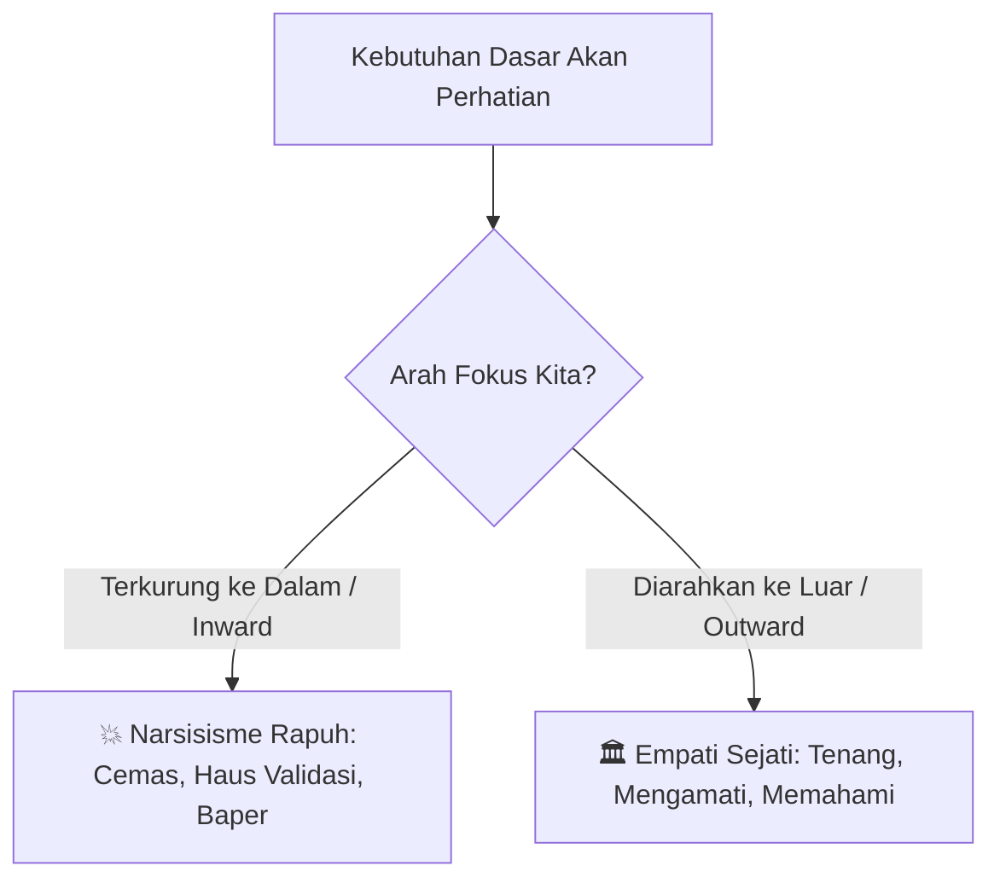

# 🌾 Empati Sebagai Kekuatan Super: Seni Membaca Manusia Tanpa Terseret Drama

> *"Kebutuhan terdalam manusia bukanlah uang atau pujian dangkal, melainkan perasaan dilihat, didengar, dan diakui apa adanya. Siapa pun yang menguasai seni memberikan perhatian murni ini memegang kunci pengaruh sosial tertinggi."*

---

## 🪞 Perangkap Cermin: Ketika Kita Terlalu Sibuk Menatap Diri Sendiri
Pernahkah Anda berada dalam sebuah percakapan di mana Anda sebenarnya tidak mendengarkan lawan bicara, melainkan sibuk merangkai kalimat cerdas apa yang akan Anda ucapkan berikutnya? Atau pernahkah Anda pulang dari sebuah pertemuan sosial dengan perasaan cemas memikirkan: *"Apakah lelucon saya tadi garing? Apakah mereka menganggap saya aneh?"*

Itulah yang disebut Robert Greene sebagai **Self-Absorption (Keterikatan Diri)**. 

Secara biologis, kita semua terlahir sebagai narsisis. Kita butuh perhatian untuk bertahan hidup. Namun, ketika sensitivitas kita terus-menerus dikurung ke dalam diri sendiri (*Inward Sensitivity*), dunia kita menyempit menjadi ruang cermin yang penuh rasa cemas, rasa tidak aman (*insecurity*), dan reaktivitas defensif.

---

## 🎭 Spektrum Narsisisme: Dari Toksik Menuju Sehat
Robert Greene mengajak kita jujur bahwa narsisisme adalah sebuah **spektrum**:

1. **Di Ujung Kiri (Deep Narcissists):** Mereka yang tidak punya fondasi diri utuh. Ego mereka sangat tipis dan rapuh sehingga butuh konfirmasi eksternal tanpa henti. Mereka menuntut dunia berputar mengelilingi mereka dan tidak segan memanipulasi orang lain (*Control Freaks*, *Drama Queens*, atau *Charming Grifters*).
2. **Di Tengah (Mayoritas Kita):** Orang fungsional yang sewaktu-waktu bisa tergelincir menjadi egois saat sedang stres atau merasa terancam.
3. **Di Ujung Kanan (Healthy Narcissists):** Mereka yang telah berdamai dengan diri sendiri. Rasa percaya diri mereka berasal dari dalam (*internal self-worth*), bukan dari validasi semu media sosial. Karena cangkir batin mereka sudah penuh, mereka memiliki kapasitas luapan energi untuk **benar-benar menyimak orang lain**.

---

## 👁️ 4 Lapisan Membangun Empati yang Mengubah Segalanya

Empati bukanlah kelemahan atau sikap pasrah. Empati sejati adalah instrumen observasi tajam yang dibangun melalui 4 pilar:

### 1. Sikap Pikiran Pemula (*The Empathetic Attitude*)
Saat berbicara dengan siapa pun—rekan kerja, klien, atau pasangan—singkirkan dorongan untuk menghakimi atau menceramahi. Masuklah dengan rasa ingin tahu murni seorang penjelajah: *"Kacamata apa yang membuat orang ini melihat dunia seperti itu?"*

### 2. Membaca Bahasa Tubuh (*Visceral Empathy*)
Mulut manusia bisa berdusta dengan kata-kata manis, tetapi mikroekspresi wajah, ketegangan bahu, perubahan nada suara, dan ritme kedipan mata selalu membocorkan suasana hati (*mood*) mereka yang sebenarnya.

### 3. Membedah Kerangka Batin (*Analytic Empathy*)
Setiap orang membawa luka masa kecil, ketakutan kegagalan, dan nilai-nilai yang mereka peluk erat. Saat rekan kerja Anda bersikap agresif atau defensif, jangan serang perilakunya; pahami ketakutan apa yang sedang ia lindungi.

### 4. Validasi Aktif (*The Empathetic Skill*)
Orang tidak butuh nasihat cerdas Anda sebelum mereka merasa **didengar dan dipahami**. Ketika Anda memvalidasi perasaan seseorang tanpa menyela, benteng pertahanan psikologis mereka luluh secara otomatis.

---

## 🛡️ Radar Perlindungan: Menjaga Batasan dari Narsisis Toksik
Melatih empati bukan berarti membiarkan diri kita menjadi santapan empuk para narsisis manipulatif. Justru dengan empati yang tajam, kita bisa membaca niat tersembunyi mereka lebih awal:

- Jika seseorang selalu membawa drama ke dalam hidup Anda, selalu memposisikan dirinya sebagai korban abadi (*perpetual victim*), dan tidak pernah membalas empati Anda: **terapkan metode *The Gray Rock***. 
- Jadilah membosankan dan netral. Jangan berikan reaksi emosional yang menjadi bahan bakar drama mereka.

---

## 🌾 Penutup: Kekuatan Sejati Berada di Luar Cermin
Ketika Anda berhenti sibuk memikirkan bagaimana orang lain memandang Anda, dan mulai fokus memahami apa yang sedang dirasakan dan dibutuhkan orang di hadapan Anda, Anda akan merasakan kebebasan batin yang luar biasa.

Empati adalah jembatan menuju kepemimpinan sejati, hubungan yang tulus, dan pengaruh sosial yang kokoh dan berwibawa.

---

## 🔗 Rantai Catatan Terkait
- 📖 Sumber Inspirasi: [[The Laws of Human Nature]]
- 🌱 Benih 1: [[Spektrum Narsisisme dan Ilusi Bebas Ego]]
- 🌱 Benih 2: [[4 Tipe Narsisis Toksik di Sekitar Kita]]
- 🌱 Benih 3: [[4 Tingkatan Melatih Empati Sejati]]
- 🌿 Tunas 1: [[Mengubah Self-Absorption Menjadi Kekuatan Empati]]
- 🌿 Tunas 2: [[Radar Mendeteksi Narsisis Toksik dan Proteksi Batasan Diri]]
- 🌳 Catatan Matang: [[Transform Self-Love into Empathy - The Law of Narcissism]]
- 🧠 Hukum 1: [[Master Your Emotional Self - The Law of Irrationality]]
