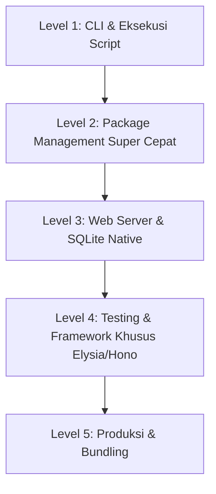

# 🍎 Panduan Lengkap Belajar Bun untuk JavaScript dan TypeScript Developer

> **Status:** Harvest (Artikel Evergreen / Panduan Lengkap)  
> **Dibuat:** 2026-08-28  

Ekosistem JavaScript selama lebih dari satu dekade didominasi oleh Node.js. Namun, kebutuhan akan kecepatan eksekusi, manajemen dependensi yang instan, serta dukungan *native* terhadap TypeScript melahirkan generasi runtime baru. Salah satu yang paling revolusioner adalah **Bun**.

Artikel ini menyajikan panduan terstruktur dari pemahaman fundamental hingga implementasi produksi menggunakan Bun.

---

## 1. Apa itu Bun dan Mengapa Berbeda?

Bun adalah *all-in-one JavaScript runtime, package manager, bundler, dan test runner* yang dirancang dari nol untuk kecepatan maksimal.

### Tiga Pilar Kecepatan Bun:
1. **Mesin JavaScriptCore (WebKit)**: Berbeda dengan Node.js dan Deno yang menggunakan mesin V8 (Google Chrome), Bun ditenagai oleh JavaScriptCore milik Apple Safari yang memiliki efisiensi memori tinggi dan waktu *startup* (cold start) sangat cepat.
2. **Ditulis Menggunakan Bahasa Zig**: Kontrol memori tingkat rendah tanpa *overhead* mesin virtual yang berat.
3. **Penyatuan Ekosistem (*All-in-One*)**: Mengurangi perantara antar-proses dengan menyatukan *runtime*, *package manager*, *bundler*, dan *tester* dalam satu biner tunggal.

---

## 2. Peta Belajar (*Learning Roadmap*)



---

## 3. Panduan Teknis Langkah Demi Langkah

### A. Memulai Proyek Baru
Membuat struktur proyek Bun hanya membutuhkan satu perintah:
```bash
mkdir my-bun-project && cd my-bun-project
bun init -y
```

### B. Menjalankan Kode TypeScript Instan
Buat file `index.ts` dan jalankan langsung tanpa kompilasi:
```typescript
// index.ts
interface User {
  id: number;
  name: string;
}

const user: User = { id: 1, name: "Riski" };
console.log(`Halo, ${user.name}!`);
```
```bash
bun run index.ts
```

### C. Membuat REST API Bawaan + SQLite Database
```typescript
import { Database } from "bun:sqlite";

const db = new Database("data.sqlite", { create: true });
db.run("CREATE TABLE IF NOT EXISTS notes (id INTEGER PRIMARY KEY AUTOINCREMENT, content TEXT)");

Bun.serve({
  port: 8080,
  async fetch(req) {
    const url = new URL(req.url);

    if (req.method === "GET" && url.pathname === "/notes") {
      const notes = db.query("SELECT * FROM notes").all();
      return Response.json(notes);
    }

    if (req.method === "POST" && url.pathname === "/notes") {
      const body = await req.json();
      db.prepare("INSERT INTO notes (content) VALUES (?)").run(body.content);
      return Response.json({ success: true }, { status: 201 });
    }

    return new Response("Not Found", { status: 404 });
  },
});

console.log("Server berjalan di http://localhost:8080");
```

---

## 4. Perbandingan Perintah: Node.js vs. Bun

| Kebutuhan | Perintah Node.js / NPM | Perintah Bun | Keuntungan Bun |
| :--- | :--- | :--- | :--- |
| **Inisialisasi** | `npm init -y` | `bun init -y` | Lebih ringkas & ada template |
| **Pasang Paket** | `npm install express` | `bun add express` | 10x–30x lebih cepat |
| **Jalankan File TS** | `npx ts-node index.ts` | `bun run index.ts` | Langsung jalan tanpa konfigurasi |
| **Hot Reload** | `npx nodemon index.ts` | `bun --watch index.ts` | Bawaan tanpa dependensi luar |
| **Unit Testing** | `npx jest` / `npx vitest` | `bun test` | Sangat cepat & memori rendah |

---

## 5. Ringkasan & Rekomendasi Penggunaan

Bun sangat ideal untuk:
- **Aplikasi Backend Baru**: Terutama dengan framework modern seperti [[Arsitektur Backend Modern dengan Bun|Elysia.js]] atau Hono.
- **Pengganti Package Manager**: Menggantikan `npm install` dalam alur kerja CI/CD untuk menghemat waktu *build*.
- **Microservices & CLI Tools**: Waktu *cold start* yang instan sangat cocok untuk arsitektur serverless atau command-line utilities.

---

## 🔗 Tautan Terkait
- Ide & Observasi Awal: [[Eksplorasi Bun Runtime dan Ekosistem]]
- Eksperimen Kode Dasar: [[Membangun Server HTTP dan SQLite dengan Bun]]
- Pola Arsitektur Modular: [[Arsitektur Backend Modern dengan Bun]]
