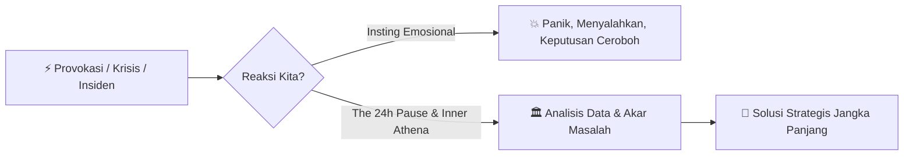

# 🌾 Seni Menguasai Diri dan Berpikir Rasional di Bawah Tekanan

> *"Kita sering membayangkan diri kita sebagai nahkoda yang tenang mengendalikan kapal logika. Namun begitu ombak emosi datang, kita sadar bahwa kita hanyalah penumpang yang terseret arus bawah sadar kita sendiri."*

---

## 🌊 Ilusi Rasionalitas Manusia
Dalam dunia rekayasa perangkat lunak (*software engineering*) maupun dunia bisnis, kita dilatih untuk memuja logika: struktur data yang rapi, algoritma efisien, metrik objektif, dan estimasi presisi. Namun ironisnya, kegagalan terbesar dalam proyek, kepemimpinan, dan hubungan antarmanusia hampir tidak pernah disebabkan oleh kurangnya kemampuan teknis—melainkan oleh **kegagalan mengendalikan dorongan emosi sesaat**.

Saat membaca bab pembuka buku *The Laws of Human Nature* karya Robert Greene mengenai **The Law of Irrationality**, saya tersadar betapa rapuhnya ilusi rasionalitas kita jika tidak dilatih dengan disiplin mental yang ketat.

---

## 🏛️ Pelajaran dari Pericles: Menemukan 'The Inner Athena'
Pada abad ke-5 SM, ketika wabah penyakit melanda Athena dan pasukan Sparta membakar ladang-ladang di luar tembok kota, warga Athena dilanda kepanikan massal. Mereka menuntut serangan balik yang ceroboh dan meluapkan kemarahan pada siapa saja.

Di tengah histeria itu, sang pemimpin, **Pericles**, melakukan sesuatu yang tampak aneh bagi orang awam: **ia menolak mengambil tindakan apa pun secara tergesa-gesa**. 

Pericles mengunci diri untuk berpikir tenang, menolak provokasi musuh, dan menunggu gelombang kepanikan publik mereda sebelum mengeksekusi strategi pertahanan laut jangka panjang. Sikap ini ia persembahkan kepada dewi **Athena**—simbol dari akal budi yang murni dan terbebas dari racun reaktivitas.

---

## 🔍 Menelanjangi 6 Bias Bawah Sadar Kita
Robert Greene menekankan bahwa musuh utama rasionalitas bukan orang lain, melainkan mekanisme pertahanan ego kita sendiri:

1. **Confirmation Bias**: Kita hanya membaca laporan atau mencari data yang membuktikan arsitektur/pendapat kita benar.
2. **Conviction Bias**: Kita mengira bahwa jika kita berdebat dengan nada paling keras dan berapi-api, maka argumen kita pasti paling valid.
3. **Appearance Bias**: Kita mudah terpesona oleh orang yang fasih berbicara teknis (*buzzwords*), padahal eksekusinya kosong.
4. **Group Bias**: Kita ikut-ikutan menyetujui keputusan tim yang buruk hanya karena takut dianggap tidak kooperatif (*groupthink*).
5. **Blame Bias**: Saat sistem *down* atau proyek *delay*, naluri pertama kita adalah mencari siapa yang bersalah dibanding mencari apa penyebab sistemik kegagalan tersebut.
6. **Superiority Bias**: Kita yakin orang lain di tim kita bias dan emosional, sementara kita sendiri merasa 100% logis dan objektif.

---

## 🛡️ 3 Kebiasaan Praktis Menumbuhkan Diri yang Rasional

Berdasarkan sintesis pemikiran ini, berikut adalah 3 kebiasaan yang saya terapkan dalam pekerjaan dan kehidupan sehari-hari:

### 1. The 24-Hour Rule (Jeda Sebelum Merespons)
Ketika menerima email yang menyulut amarah, kritik kode yang terasa pedas, atau kabar buruk yang mengejutkan: **jangan pernah membalas dalam 15 menit pertama**. 
Tutup laptop, berjalan kaki sejenak, atau tidur semalam. Hormon kortisol dan adrenalin butuh waktu untuk luruh. Keesokan paginya, Anda akan merespons dengan kalimat yang jauh lebih bijak dan berbobot.

### 2. People as Facts (Terima Orang Lain Seperti Fenomena Alam)
Ketika berhadapan dengan rekan kerja yang keras kepala atau atasan yang emosional, jangan tersinggung secara personal. Perlakukan mereka seperti cuaca hujan atau hukum gravitasi. Kita tidak marah pada hujan karena turun membasahi tanah; kita cukup menyiapkan payung. Begitu pula dengan manusia—amati polanya, antisipasi langkahnya, dan jangan biarkan emosi mereka meracuni ketenangan batin Anda.

### 3. Blameless Problem Solving (Fokus Pada Sistem, Bukan Orang)
Dalam setiap kegagalan, hilangkan kata *"Siapa yang salah?"* dan gantilah dengan *"Proses atau sistem apa yang memungkinkan kesalahan ini terjadi?"*. Ini melumpuhkan *Blame Bias* dan menciptakan lingkungan kerja yang aman secara psikologis.

---

## 🌾 Penutup: Menemukan Kedamaian dalam Rasionalitas
Rasionalitas bukanlah tentang menjadi manusia dingin tanpa perasaan. Rasionalitas adalah seni menyelaraskan energi emosi dengan panduan akal sehat. Dengan melatih *The Inner Athena* setiap hari, kita tidak hanya menjadi pengambil keputusan yang lebih tajam, tetapi juga pribadi yang lebih tenang, matang, dan merdeka dari manipulasi dunia luar.

---

## 🔗 Rantai Evolusi Pemikiran Ini
- 📖 Sumber Inspirasi: [[The Laws of Human Nature]]
- 🌱 Benih Awal 1: [[The Inner Athena dan Waktu Jeda Reaksi]]
- 🌱 Benih Awal 2: [[6 Bias Emosional Bawah Sadar]]
- 🌿 Tunas Elaborasi: [[Anatomi Irasionalitas dan Emosi Bawah Sadar]]
- 🌳 Catatan Pengetahuan Matang: [[Master Your Emotional Self - The Law of Irrationality]]
