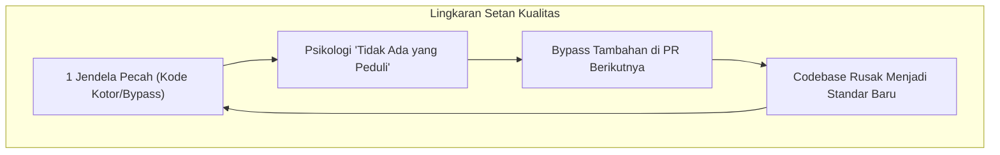

# 🌾 Strategi Menyelamatkan Codebase dari Software Rot dan Technical Debt

> **Status:** Harvest (Karya / Artikel Publikasi)  
> **Penulis:** Riski  
> **Terbit:** 21 Agustus 2026  
> **Diadaptasi dari:** Riset Knowledge Garden & [[The Pragmatic Programmer]]  

---

> [!tip] Rangkuman Eksekutif
> Banyak proyek perangkat lunak gagal bukan karena kekurangan fitur canggih, melainkan karena **Software Rot**—penurunan kualitas internal kode yang memicu keputusasaan tim. Artikel ini menyajikan kerangka kerja taktis bagi engineer dan tech lead untuk mengidentifikasi "jendela pecah" dan membalikkan keadaan sebelum sistem runtuh.

---

## 🌪️ Fenomena Entropi Perangkat Lunak

Di awal peluncuran sebuah proyek, codebase biasanya terasa bersih, rapi, dan mudah dikembangkan. Namun seiring waktu, beberapa hal mulai terjadi:
- Fitur baru membutuhkan waktu rilis 3x lebih lama dibanding tahun lalu.
- Memperbaiki satu bug di modul A justru memunculkan 3 bug baru di modul B.
- Para developer mulai berkata: *"Jangan sentuh bagian modul itu, kodenya rawan rusak."*

Fenomena ini dikenal sebagai **Software Entropy** atau **Software Rot**. Berdasarkan prinsip dasar dalam *The Pragmatic Programmer*, hukum ketidakteraturan akan selalu menimpa software kecuali jika tim secara sengaja dan berkelanjutan melakukan perawatan aktif.

---

## 🪟 Teori Jendela Pecah: Mengapa Kualitas Bisa Runtuh Begitu Cepat?

Kunci utama kehancuran codebase bukanlah kelemahan bahasa pemrograman atau framework, melainkan **faktor psikologis tim**:
1. **Toleransi terhadap kode jelek**: Ketika seorang developer melihat kode berantakan lolos ke branch utama (*main*), ia akan merasa bodoh jika menghabiskan waktu menulis kode bersih.
2. **Efek Domino**: Sekali satu pengecualian dibiarkan ("nanti saja dirapikan pas ada waktu luang"), seluruh tim akan mulai menurunkan standar mereka.

---

## 🛡️ Framework 4 Langkah Melawan Software Rot

Untuk membalikkan keadaan dari *vicious cycle* menuju *virtuous cycle*, terapkan 4 pilar berikut:

### 1. Zero Tolerance for "Broken Windows"
Segera perbaiki kode yang cacat saat pertama kali ditemukan. Jika Anda belum sempat melakukan refactoring besar, berikan batasan proteksi:
- Tambahkan komentar TODO yang jelas beserta ticket tracker.
- Buat *Unit Test* di sekitar fungsi tersebut agar kerusakan tidak melebar.

### 2. Boy Scout Rule di Code Review
Terapkan kebiasaan bahwa setiap *Pull Request* wajib meninggalkan codebase sedikit lebih baik daripada kondisi sebelumnya:
- Hapus variabel atau fungsi mati (*dead code*).
- Rapikan penamaan variabel yang ambigu.
- Tambahkan type hints dan return type (misal: fitur modern PHP 8.x / TypeScript).

### 3. Taktik "Stone Soup" untuk Perubahan Budaya
Jika tim Anda skeptis terhadap standarisasi baru (seperti Automated Testing atau Linter otomatis):
- **Jangan paksakan aturan raksasa sekaligus.**
- Mulailah dengan membuat contoh kecil pada satu fitur yang Anda kerjakan. Tunjukkan bagaimana testing membuat pekerjaan Anda lebih cepat dan minim bug.
- Biarkan rekan satu tim terinspirasi dan bergabung secara sukarela.

### 4. Jadwalkan "Technical Debt Paydown" Rutin
Alokasikan 10–15% kapasitas waktu pada setiap iterasi *sprint* murni untuk *refactoring* dan pembaruan dependensi, bukan menunggu sampai sistem lumpuh total.

---

## 🎯 Kesimpulan

Menulis kode bersih bukanlah tindakan perfeksionisme yang membuang waktu, melainkan investasi kecepatan (*velocity*) jangka panjang. Lawan entropi software Anda hari ini dengan memperbaiki satu "jendela pecah" di repositori Anda.

---

## 🔗 Rantai Pengetahuan (From Seed to Harvest)
- 📖 Literatur: [[The Pragmatic Programmer]]
- 🌱 Benih Awal: [[Software Entropy dan Technical Debt]] & [[Stone Soup dan Boiled Frogs]]
- 🌿 Catatan Berkembang: [[Software Entropy dan Broken Windows Theory]]
- 🌳 Panduan Arsitektur: [[Software Entropy dan Strategi Mengatasi Technical Debt]]
- 🧹 Praktik Bersih: [[Penerapan 5 Prinsip SOLID dan Refactoring Code Smells]]
