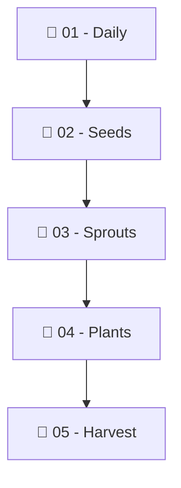

# 🌳 Riski's Technology Knowledge Garden

> *A place to capture daily thoughts, cultivate software engineering concepts, and grow lifetime tech knowledge.*

---

> [!note] Mekanisme Explicit Publishing
> Catatan baru yang Anda buat secara default bersifat **privat (rahasia)**. Catatan hanya akan muncul di web jika Anda menambahkan `publish: true` pada frontmatter YAML di bagian atas file.

---

## 🧭 Navigation & Areas

| Area | Purpose | Status Publik |
| :--- | :--- | :--- |
| **01 - Daily** | Catatan harian & penangkapan ide spontan | Privat |
| **02 - Seeds 🌱** | Ide & observasi mentah | Privat |
| **03 - Sprouts 🌿** | Ide yang sedang dikembangkan | Privat |
| **04 - Plants 🌳** | Pengetahuan matang & terhubung (Evergreen) | Dipublikasikan (`publish: true`) |
| **05 - Harvest 🌾** | Hasil karya, proyek, & keputusan | Dipublikasikan (`publish: true`) |
| **06 - Sources 📚** | Buku, artikel, video, & paper | Privat / Terpilih |

---

## 🔄 Growth Cycle

---

## 🌱 7 Aturan Emas Garden
1. **Daily Notes bersifat kronologis**: Tempat mencatat spontan harian.
2. **Seeds boleh berantakan**: Cukup tangkap pemikiran awal.
3. **Garden Notes berisi pemahaman sendiri**: Tulis dengan bahasa Anda sendiri.
4. **Links lebih penting dari folder**: Gunakan `[[...]]` untuk membangun jaringan pengetahuan.
5. **Tidak semua Seed harus jadi Garden**: Wajar jika ada Seed yang tidak dilanjutkan.
6. **Evergreen bukan berarti selesai**: Catatan matang terus berkembang.
7. **Jangan over-optimize**: Utamakan menulis pengetahuan dibanding merapikan visual.
