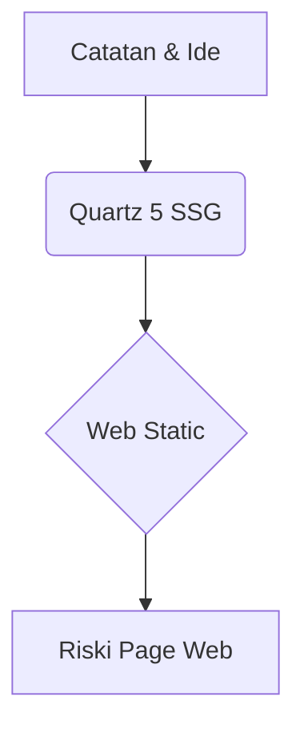

Hi, selamat datang di **Riski Page**! 👋

Halaman ini dibuat menggunakan **Quartz 5** & GitHub Pages. Berisi catatan, informasi, tutorial, dan hasil bacaan yang saya pelajari.

> [!note] Catatan & Inspirasi
> Situs ini terinspirasi dari konsep *Digital Garden* & karya Alex Turner ([turntrout.com](https://turntrout.com)).

> [!tip] Fitur Utama Riski Page
> - 🚀 **Fast & Responsive**: Dibangun di atas Quartz 5 SSG.
> - 🧠 **Knowledge Graph**: Hubungan antar catatan tervisualisasi secara interaktif.
> - 📝 **Markdown & Callouts**: Mendukung sintaks Obsidian, diagram Mermaid, dan matematika KaTeX.

